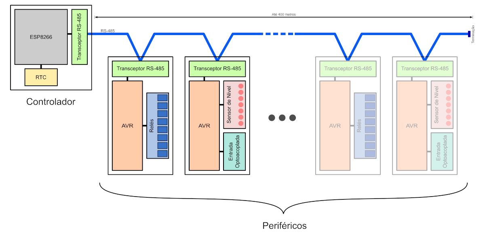
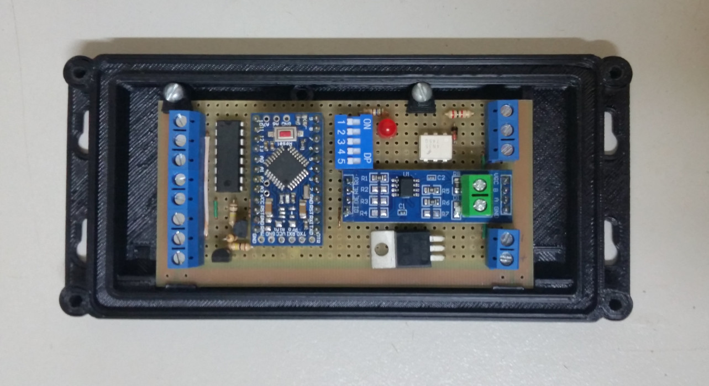
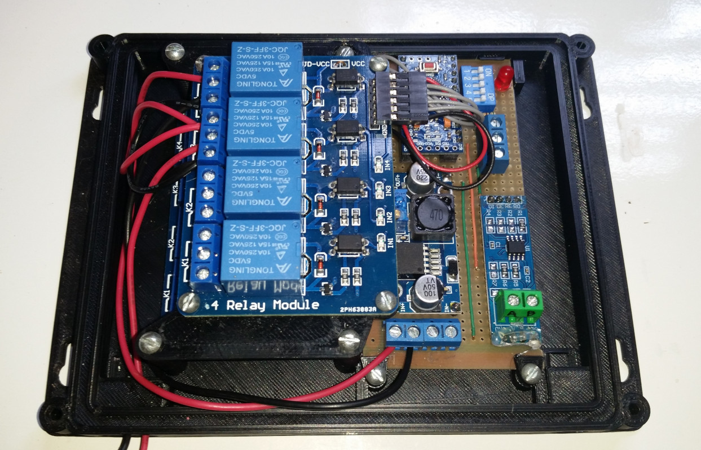

## SACI - Sistema de Automação com Controle via Internet

SACI é um sistema modular de automação, o módulo principal pode ser conectado, via cabo de par-trançado, à até 32 módulos periféricos, com uma distância máxima de 400 metros entre os módulos das extremidades.

A conexão com a rede é feita via Wi-Fi. O usuário pode acessar diretamente o IP do módulo controlador para utilizar a interface web, que permite visualizar dados dos sensores e modificar o estado do sistema, ou mesmo modificar configurações.

Além da interface Web o sistema também pode se conectar a um servidor MQTT (com suporte a SSL), desta maneira o usuário pode inspecionar e controlar todo o sistema remotamente, via internet.

Este repositório é apenas para o código dos módulos periféricos, o código principal está em  [outro repositório](https://github.com/mapame/saci-controlador-esp8266).

### Módulos periféricos

Os módulos periféricos fazem efetivamente a leitura de sensores e controle de atuadores, mas sob comando do módulo controlador. Um microcontrolador AVR (ATmega328P) e um transceptor MAX-485 são os componentes base de todos os módulos periféricos, mas dependendo da função específica do módulo, podem ser adicionados outros componentes. O firmware foi desenvolvido em C, utilizando [avr-gcc](https://gcc.gnu.org/wiki/avr-gcc) e [avr-libc](https://savannah.nongnu.org/projects/avr-libc/).

#### Módulo para leitura de nível de água

Este módulo faz a leitura do nível de um reservatório de água utilizando eletrodos de aço inoxidável, que quando em contato direto com a água permitem o fluxo de uma pequena corrente elétrica. Podem ser conectados 7 eletrodos detectores e 1 eletrodo comum, o sinal é detectado utilizando um circuito integrado ULN2003, que permite detectar o fluxo de corrente até mesmo se a água tiver baixa condutividade, que geralmente é o caso de água potável.

Este módulo também tem uma entrada optoacoplada, que permite a leitura de um sinal digital de até 24V. A entrada também tem recurso de frequencímetro, que permite a leitura de sensores de fluxo de água.

#### Módulo de relés

Este módulo permite o controle de qualquer dispositivo que possa ser controlado através de seus 8 relés, limitado apenas pelas especificações dos relés (10A a 250VAC ou 15A a 125VAC), com disponibilidade de contatos normalmente abertos e normalmente fechados.

